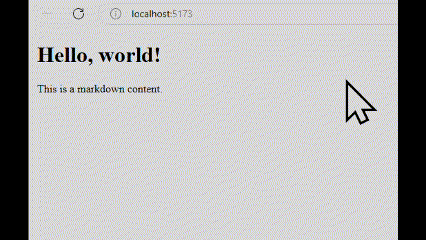

# disappear mermaid graph bug

하이드레이션 과정에서 머메이드 그래프가 사라지는 버그를 재현하기 위한 저장소입니다.

## 외부 의존성

https://github.com/remcohaszing/remark-mermaidjs
마크다운 파서의 머메이드 플러그인을 사용하기 때문에 추가적으로 설치해야 합니다. 

```shell
npx playwright install --with-deps chromium
```
